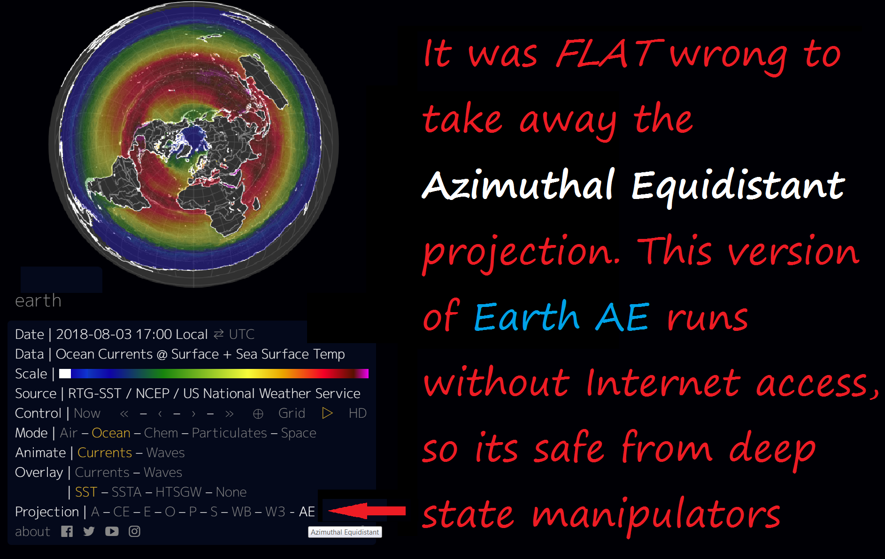
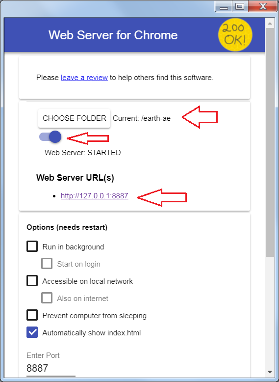

# Earth AE

An interactive, animated visualization of global **wind, weather, and ocean conditions** — with a satisfyingly flat **Azimuthal Equidistant (AE)** projection that presents a clear, obvious picture of world-wide weather patterns.

Based on [earth.nullschool.net](https://earth.nullschool.net/) ([source](https://github.com/cambecc/earth)), which removed its AE view. This fork restores AE and runs **entirely offline** from local data files.



---

## How it works

Earth AE is a **static, client-side web app** — there is no backend server.

| Piece | Role |
|-------|------|
| `index.html` | App shell. Stacks full-screen `<canvas>` layers (map, animation, overlay, foreground) and drives the engine. |
| `js/bundle.js` | The earth engine (webpacked, bundles D3-geo). Draws coastlines, overlays weather data, and animates wind as moving particles. AE changes are marked `// MAL`. |
| `data/` | Local weather data (`.epak`) and map geometry (`.json`). The app fetches these over HTTP — a static file server is required. |
| `styles/` | Fonts used by the UI. |
| `ios/` | Optional SwiftUI wrapper that embeds the app in a `WKWebView` (see below). |

### Data layout (`data/`)

- **Geometry (TopoJSON):** `earth-topo.json`, `earth-topo-mobile.json`, `world-50m.json`, `world-110m.json`, `states-50m.json`
- **GFS weather** (`data/gfs/`): wind, temperature, precipitation (3hr), relative humidity, total cloud water
- **CAMS air quality** (`data/cams/`): PM2.5

Each source has a `current/` folder (the default view) plus dated `YYYY/MM/DD/HHmm-*.epak` folders used by the time slider.

---

## Run it locally

A static file server is required (the app fetches `.epak`/JSON via HTTP).

```bash
./start-server.sh          # runs: python3 -m http.server 8080
```

Then open <http://localhost:8080>.

> **Windows / Chrome alternative:** install the [Web Server for Chrome](https://chrome.google.com/webstore/detail/web-server-for-chrome/ofhbbkphhbklhfoeikjpcbhemlocgigb) extension, point **CHOOSE FOLDER** at this directory, start it, and open <http://127.0.0.1:8887>.
>
> 

---

## Refresh the weather data

`download-forecast.py` pulls fresh GFS + CAMS data from nullschool's data host and rebuilds the `current/` layers. By default it fetches a window of **12 hours back to 72 hours forward** at hourly intervals, then prunes data older than 24 hours.

```bash
python3 download-forecast.py
```

Tunable constants at the top of the script: `HOURS_BACK`, `HOURS_FWD`, `INTERVAL_HOURS`, `MAX_WORKERS`.

> Some files may not update due to CORS headers on the source. If a layer looks stale, open <https://earth.nullschool.net/>, use the browser Network tab to find the `.epak` file, download it, and drop it into the matching path under `data/`.

---

## iOS wrapper (optional)

`ios/` contains a SwiftUI app that loads this web app in a `WKWebView` and controls it through a JavaScript bridge, `window.EarthBridge`:

- `EarthBridge.setLayer(...)` — switch the active data layer
- `EarthBridge.setDateTime(...)` — jump to a specific time
- `EarthBridge.getRenderedDate()` — read back the currently rendered time

`index.html` includes a small patch that wraps `getRenderedDate` in a try/catch so a bad date from the native side can't crash the view.

Key files: `ContentView.swift`, `EarthWebView.swift`, `EarthMapViewModel.swift`, `EarthLayer.swift`, `LayersControlView.swift`, `ColorLegendView.swift`.

---

## Repository layout

```
.
├── index.html              # app shell
├── js/bundle.js            # earth engine (AE changes marked // MAL)
├── styles/                 # fonts
├── data/                   # weather (.epak) + geometry (.json)
├── ios/                    # SwiftUI WKWebView wrapper
├── download-forecast.py    # refresh weather data
├── start-server.sh         # local static server
├── docs/                   # screenshots
└── reference/              # dev tools + nullschool bundle kept for diffing
```

---

## License

See [LICENSE](LICENSE). Original project © Cameron Beccario — see [github.com/cambecc/earth](https://github.com/cambecc/earth).
